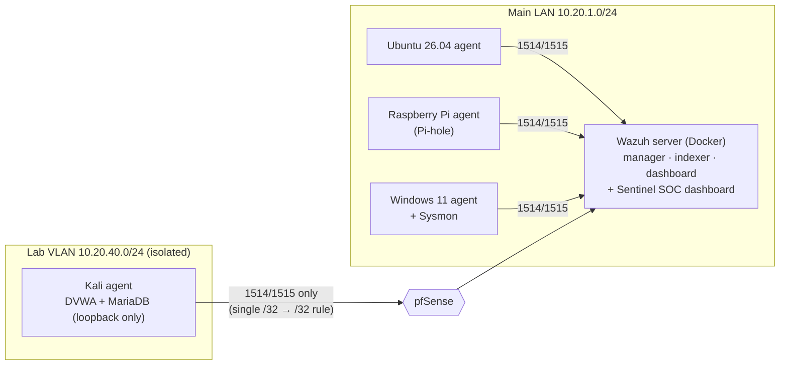

# Homelab SIEM & Detection Lab

A single-node **Wazuh 4.14.8** SIEM watching a segmented home network. The project covers deployment, alert tuning backed by evidence, CIS hardening of the SIEM server itself, and an isolated lab target whose logs flow into the SIEM. Alerts also show up in my own SOC dashboard, **[Sentinel](https://github.com/KevinTechLabs/Homelab-Soc-Dashboard)**, through a read-only, certificate-pinned integration.

Every number below came from my own environment. Addresses in this repo are replaced with a fake `10.20.x.x` plan, and no credentials, keys or real IPs are published.

## Highlights

| Area | Result |
|---|---|
| Deployment | Wazuh manager, indexer and dashboard in Docker; 5 agents (Windows 11 + Sysmon, 2× Ubuntu 26.04, Debian 13 on a Raspberry Pi, Kali) |
| Alert tuning | 3 custom rules removed **~1,700 false-positive level-12/15 alerts a day**. Each one matches a single verified binary and behavior, so everything else still alerts at full severity ([details](docs/tuning.md)) |
| Vulnerabilities | **−25 % total / −38 % critical** findings after purging stale kernels and patching |
| CIS hardening | SIEM server raised from **47 % → 67 %** in 6 batches, with **zero lockouts** and one planned reboot ([details](docs/hardening.md)) |
| Benchmark QA | Found and documented **10+ benchmark/tooling defects** where a control was applied but reported as failed (audit 4.x, sudo-rs, PAM) |
| Lab | Vulnerable web app on an isolated VLAN, published only on loopback. Web logs verified end to end into the SIEM, and two detection gaps documented ([details](docs/lab.md)) |
| Integration | Sentinel reads Wazuh through read-only accounts, with SHA-256 certificate pinning and deep links back into Wazuh |

## Architecture



- Agents talk to the manager on **1514/1515** only. The API (55000), indexer (9200) and syslog (514) are bound to `127.0.0.1`.
- The Lab VLAN cannot reach any other zone. Its single exception is one pfSense pass rule: Kali /32 → Wazuh server /32, TCP 1514–1515.

## Repo layout

| Path | What it is |
|---|---|
| [`docs/tuning.md`](docs/tuning.md) | Alert triage write-ups: evidence, decision, rule, verification |
| [`docs/hardening.md`](docs/hardening.md) | CIS batches on the SIEM server, accepted risks, benchmark defects |
| [`docs/lab.md`](docs/lab.md) | Isolated lab target, log pipeline, detection gaps |
| [`rules/local_rules.xml`](rules/local_rules.xml) | The custom Wazuh tuning rules |
| [`scripts/wazuh-alert-summary.py`](scripts/wazuh-alert-summary.py) | Read-only triage report: severity, per day, per agent, top rule+agent pairs |

## Alert summary script

```bash
sudo python3 scripts/wazuh-alert-summary.py --days 3
sudo python3 scripts/wazuh-alert-summary.py --days 7 --top 40 --out ~/alert-summary.md
```

The script uses only the Python standard library. It reuses the read-only indexer account and pinned certificate fingerprint that Sentinel's `--wazuh-setup` stores in `/etc/sentinel/wazuh.json` (root-only), and refuses to connect if the certificate changed. Output is Markdown, so repeat noise and rare high-severity rules stand out.

## What I'd do differently

- **Tune with evidence, never by rule ID.** Every exception here is scoped to a signed binary path plus the exact behavior: an access mask, a filename pattern, or a parent process. Disabling a whole rule would have hidden real attacks.
- **Correlate alerts with your own activity.** One "critical" alert was caused by me opening PowerShell to investigate a different alert.
- **Don't trust a compliance score blindly.** About 10 CIS "failures" were controls that were already applied but checked with outdated tooling assumptions.
- **Check that the pipeline works before trusting silence.** A harmless 404 proved logs reached the SIEM. Only then did "no alert" mean a real detection gap rather than a broken pipeline.

## Tools

Wazuh 4.14.8 · OpenSearch · Sysmon · Docker · pfSense (VLANs) · auditd · AIDE · AppArmor · PAM · Kali Linux · DVWA · Python
